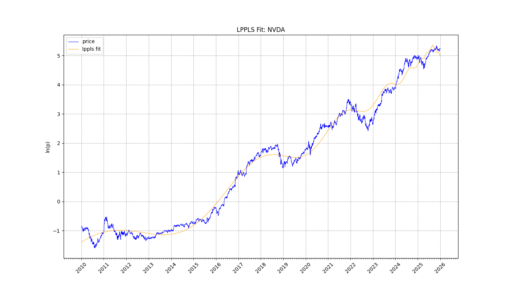
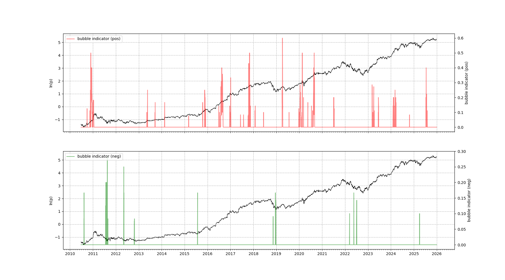

# LPPLS Analyzer

This project runs the **Log-Periodic Power Law Singularity (LPPLS)** model on financial data to detect bubble regimes and predict critical turning points (crashes or rebounds).

---

## 1. Setup & Installation

Before running any scripts, ensure your Python virtual environment is active.

**PowerShell:**
```powershell
.\lppls\venv\Scripts\Activate.ps1
```

**Command Prompt:**
```cmd
.\lppls\venv\Scripts\activate.bat
```

---

## 2. How to Run Simulations

You can run the model on any ticker (stock, crypto, index) supported by Yahoo Finance.

### Option A: Custom Analysis (`custom_run.py`)
Use this for ad-hoc analysis of specific assets.

1.  **Edit Configuration**:
    Open `custom_run.py` and modify the top section:
    ```python
    TICKERS = ["NVDA", "BTC-USD"]  # List of symbols
    START_DATE = "2020-01-01"      # Start of analysis window
    # END_DATE is set to today automatically
    ```
2.  **Run**:
    ```powershell
    python custom_run.py
    ```
3.  **Outputs**:
    Results are saved in the `manual_plots/` directory.

### Option B: Daily Automation (`indices.py`)
Use this for automated daily tracking of major indices.

1.  **Configuration**:
    The script has pre-configured tickers (e.g., ^NDX, SPY, BTC-USD).
2.  **Run**:
    ```powershell
    python indices.py
    ```
3.  **Outputs**:
    Results are saved in the `daily_plots/` directory.
    *   **Auto-Cleanup**: This script automatically deletes files older than 3 days to keep the folder clean.

---

## 3. Output Files & Features

For each analyzed ticker, the system generates three files:

1.  **`{TICKER}_{DATE}_fit.png`**:
    *   Visualizes the price history vs. the theoretical bubble curve.
2.  **`{TICKER}_{DATE}_confidence.png`**:
    *   Shows "Confidence Spikes" indicating the probability of a crash or rebound.
3.  **`{TICKER}_{DATE}_confidence.csv`** (New Feature):
    *   Contains the raw data for the confidence signals.
    *   **Columns**:
        *   `Date`: The date of the signal.
        *   `Value`: The strength of the signal (0.0 - 1.0).
        *   `Type`:
            *   **"Top"**: Indicates a potential market top (Crash risk).
            *   **"Bottom"**: Indicates a potential market bottom (Rebound opportunity).

---

## 4. Interpretation Guide

### The "Fit" Graph
**File:** `{TICKER}_fit.png`

This graph shows the price history overlaid with the model's "Theoretical Bubble" curve.

#### The Axes
*   **X-Axis (Time)**: The date range of your data.
*   **Y-Axis (ln(p))**: The **Natural Logarithm** of the price.
    *   *Why Log?* On a normal chart, exponential growth looks like a curve. On a log chart, exponential growth looks like a straight line.
    *   **Super-Exponential**: The LPPLS model looks for lines that curve *upwards* even on a log chart. This acceleration is the signature of a bubble.

#### The Lines
*   **<span style="color:blue">Blue Line (Price)</span>**: The actual market price history.
*   **<span style="color:orange">Orange Line (Fit)</span>**: The model's best attempt to mathematically describe the current bubble.

#### What to Look For (The "Wobble")
A bubble isn't just a price going up; it's a price that oscillates faster and faster as it rises.
*   **Good Signal**: If the **Blue Price** peaks and dips perfectly in sync with the **Orange Fit** line's wobbles, this is strong confirmation. It means the "Herd Behavior" (greed vs. fear cycles) is following a predictable mathematical pattern.
*   **Crossing/Weaving**: It is healthy for the price to cross above and below the orange line. The orange line acts as the "center of gravity."

#### Warning Signs (Divergence)
*   **Price Rips Way Above Fit**: If the Blue line shoots far above the Orange line, the market has gone "hyper-manic." This often precedes a crash.
*   **Price Drops Below Fit**: If the Blue line drops significantly below the Orange line and fails to recover, the positive feedback loop might be broken. The bubble may have "popped" early.

#### NVDA Example Analysis

*   **2016 - 2019**: Notice how the Blue price hugs the Orange fit line closely, respecting the wobbles. The model captures the trend well.
*   **2022 - 2023**: A large dip where price fell below the trend, but it recovered.
*   **Current Status**: The price is weaving tightly around the fit line, suggesting the bubble regime is currently intact (the 'super-exponential' trend is still valid).

---

### The "Confidence" Graph
**File:** `{TICKER}_confidence.png`

This graph tells you how *reliable* the bubble signal is. The model runs hundreds of tests on different time windows (e.g., last 200 days, last 500 days).

#### The Axes
*   **Left Y-Axis (Black Line)**: The Price (in Log scale) again, for reference.
*   **Right Y-Axis (Colored Spikes)**: **Confidence Indicator (0.0 to 1.0)**.
    *   **0.0 (0%)**: No agreement. No bubble detected.
    *   **0.5 (50%)**: Half of the tested timeframes agree a bubble is forming.
    *   **1.0 (100%)**: Perfect consensus. A critical signal.

#### The Indicators
*   **<span style="color:red">Red Spikes (Pos)</span>**: Probability of a **Bubble Top / Crash**.
    *   Look for clustering of red spikes as the price rises.
    *   A high spike means "We are approaching the Critical Time ($t_c$)."
*   **<span style="color:green">Green Spikes (Neg)</span>**: Probability of a **Bubble Bottom / Rebound**.
    *   These occur during crashes, signaling distinct "fear" patterns that suggest the bottom is near.

#### Date Precision & CSV Data (New Feature)
The X-axis shows monthly and yearly ticks, but for **exact** precision, refer to the generated CSV file.

1.  **Look for Spikes**: identify high red or green spikes on the chart.
2.  **Open CSV**: Open `{TICKER}_confidence.csv`.
3.  **Find Exact Date**:
    *   Filter for `Type = "Top"` to see crash warnings.
    *   Filter for `Type = "Bottom"` to see buying opportunities.
    *   High values (e.g., > 0.5) confirm the critical signal seen on the chart.

#### NVDA Example Analysis

*   **Top Chart (Red/Pos)**:
    *   Notice the clusters of red spikes during the rapid ascents.
    *   The recent data (far right) shows the indicator rising to nearly **0.6 (60%)**, suggesting growing consensus among the models that the current trend is becoming unstable.
*   **Bottom Chart (Green/Neg)**:
    *   Notice the massive green spike around **late 2018 / early 2019**.
    *   This perfectly marked the bottom of that correction, signaling a buying opportunity before the next rally.

---

### Summary
1.  **Run** `custom_run.py`.
2.  **Check Fit**: Does the Blue Price wiggle in sync with the Orange Fit?
3.  **Check Confidence**: Are there Red Spikes (Crash Risk) or Green Spikes (Rebound Opportunity) appearing right now?
4.  **Verify with CSV**: Open the generated CSV to get the exact dates and confidence values.
