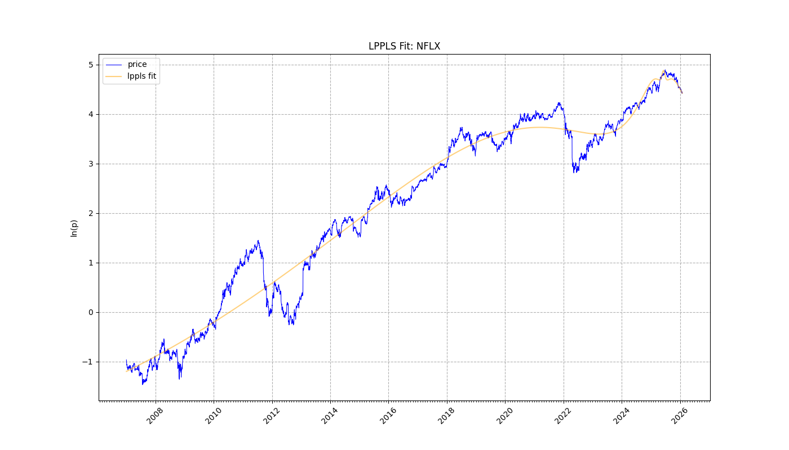
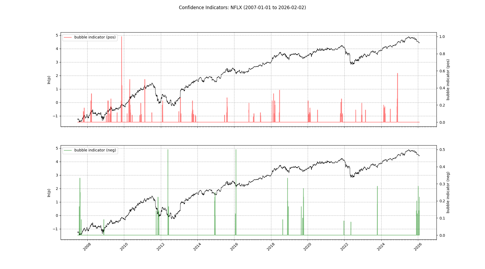
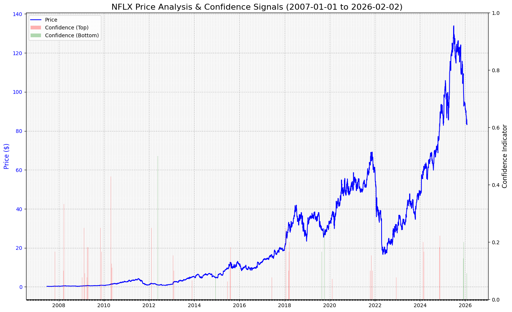
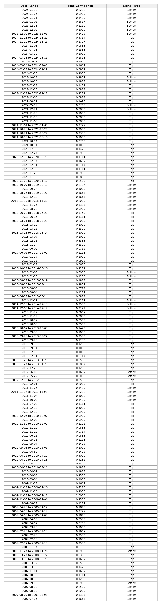

# LPPLS Analyzer

This project runs the **Log-Periodic Power Law Singularity (LPPLS)** model on financial data to detect bubble regimes and predict critical turning points (crashes or rebounds).

---

## 1. Setup & Installation

Before running any scripts, ensure your Python virtual environment is active.

**PowerShell:**
```powershell
.\lppls\venv\Scripts\Activate.ps1
```

**Command Prompt:**
```cmd
.\lppls\venv\Scripts\activate.bat
```

---

## 2. How to Run Simulations

You can run the model on any ticker (stock, crypto, index) supported by Yahoo Finance.

### Option A: Custom Analysis (`custom_run.py`)
Use this for ad-hoc analysis of specific assets.

1.  **Edit Configuration**:
    Open `custom_run.py` and modify the top section:
    ```python
    TICKERS = ["NFLX", "BTC-USD"]  # List of symbols
    START_DATE = "2020-01-01"      # Start of analysis window
    # END_DATE is set to today automatically
    ```
2.  **Run**:
    ```powershell
    python custom_run.py
    ```
3.  **Outputs**:
    Results are saved in the `manual_plots/` directory.

### Option B: Daily Automation (`indices.py`)
Use this for automated daily tracking of major indices.

1.  **Configuration**:
    The script has pre-configured tickers (e.g., ^NDX, SPY, BTC-USD).
2.  **Run**:
    ```powershell
    python indices.py
    ```
3.  **Outputs**:
    Results are saved in the `daily_plots/` directory.
    *   **Auto-Cleanup**: This script automatically deletes files older than 3 days to keep the storage efficient.

---

## 3. Output Files & Features

For each analyzed ticker, the system generates a comprehensive suite of artifacts:

### Visualizations
1.  **`{TICKER}_..._fit.png`**:
    *   Visualizes the price history vs. the theoretical bubble curve.
2.  **`{TICKER}_..._confidence.png`**:
    *   Shows "Confidence Spikes" indicating the probability of a crash (Red) or rebound (Green).
3.  **`{TICKER}_..._cumulative.png`** (New):
    *   **Overlay Chart**: Plots the Price history with the Confidence spikes superimposed directly on top. Best for timing.
4.  **`{TICKER}_..._cumulative_table.png`** (New):
    *   **Signal Table**: A compact, sorted list of all detected signal clusters (Recent first).

### Analyst Reports (New!)
The system now generates professional-grade briefings:
5.  **`{TICKER}_..._report.pdf`**:
    *   A multi-page PDF executive summary containing all charts, tables, and **Dynamic Analyst Commentary**.
6.  **`{TICKER}_..._report.md`**:
    *   The same content in Markdown format for easy web viewing.

### Data
7.  **`{TICKER}_..._confidence.csv`**:
    *   Contains the raw confidence values for every date in the analysis window.
    *   **Columns**: `Date`, `Value`, `Signal Type` (Top/Bottom). Use this to find the exact date of a spike seen in the charts.

---

## 4. Interpretation Guide

### The "Fit" Graph
**File:** `*_fit.png`

This graph shows the price history overlaid with the model's "Theoretical Bubble" curve.

*   **<span style="color:blue">Blue Line (Price)</span>**: The actual market price history.
*   **<span style="color:orange">Orange Line (Fit)</span>**: The model's mathematically projected super-exponential path.

#### NFLX Example


**How to Read:**
If the Blue price is faithfully tracking the Orange line's upward acceleration (and its oscillations), the bubble is robust. If they diverge significantly, the regime may have broken.

---

### The "Confidence" Graph
**File:** `*_confidence.png`

This graph aggregates hundreds of varying time-window tests to find consensus.

*   **<span style="color:red">Red Spikes (Top)</span>**: Consensus that a **Crash** is imminent.
*   **<span style="color:green">Green Spikes (Bottom)</span>**: Consensus that a **Rebound** is imminent.

#### NFLX Example


**How to Read:**
Look for **Clusters**. A single thin line might be noise. A dense, wide block of Red or Green indicates that short-term, medium-term, and long-term models all agree: **The turning point is near.**

---

### The Cumulative Overlay
**File:** `*_cumulative.png`

This is the most powerful visual for timing. It places the signals directly on the price chart.

#### NFLX Example


**How to Read:**
*   **Red Bars appearing at Highs**: This confirms the model sees the current rally as unsustainable.
*   **Green Bars appearing at Lows**: This confirms the model sees the current drop as a capitulation event (buying opportunity).

---

### The Signal Table
**File:** `*_cumulative_table.png`

This provides the raw numerical data for the clusters seen in the Cumulative Overlay.

#### NFLX Example


**How to Read:**
*   **Sorted by Date**: The most recent signals are at the top.
*   **Max Confidence**: How strong was the strongest signal in that cluster? (0.0 - 1.0)
*   **Signal Type**: 'Top' (Crash Risk) or 'Bottom' (Rebound Opportunity).

---

### Analyst Report & Dynamic Commentary

The generated **PDF Report** includes **Dynamic Observations**:
*   **Critical Time ($t_c$)**: The script calculates if the projected crash date is in the past (warning of regime shift) or future (countdown in days).
*   **Trend Analysis**: "Observation: The last 3 detected clusters were all 'Top' signals..."

This allows you to quickly gauge the state of the asset without manually interpreting every raw data point.
