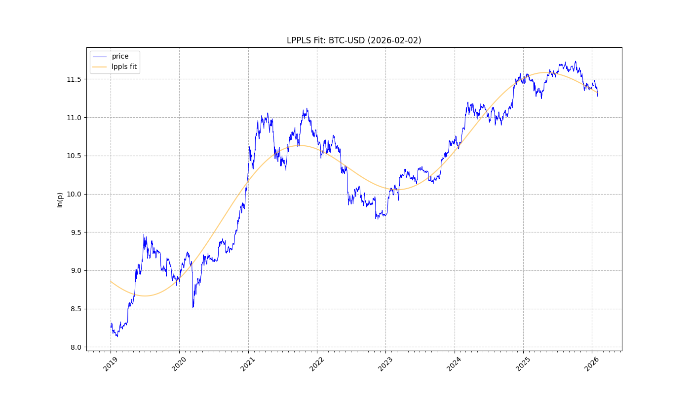
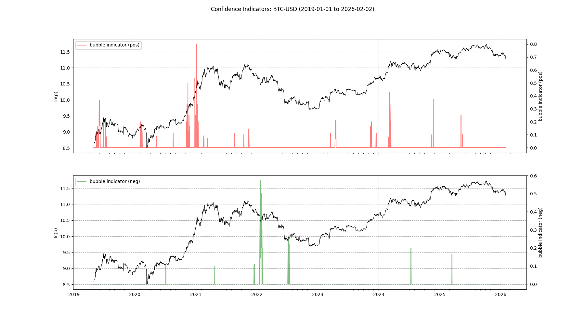
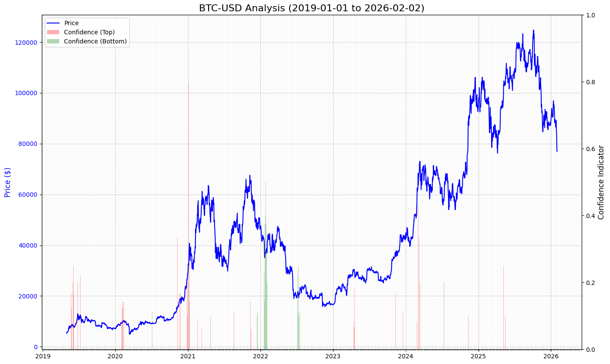
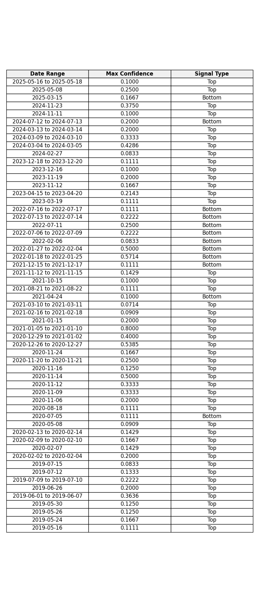

# Report: BTC-USD
**Date:** 2026-02-02

## 1. Fit & Critical Time
**$t_c$ Projection:** 2114-11-30

## 2. Confidence

## 3. Cumulative Chart

## 4. Signal Table

## Summary
Analysis for **BTC-USD** (2019-01-01 to 2026-02-02)
Signals Detected: **57**
- **45** Top Signals
- **12** Bottom Signals

Latest: **Top** on **2025-05-16 to 2025-05-18** (Conf: 0.1000).

Projected Critical Time ($t_c$): **2114-11-30**
