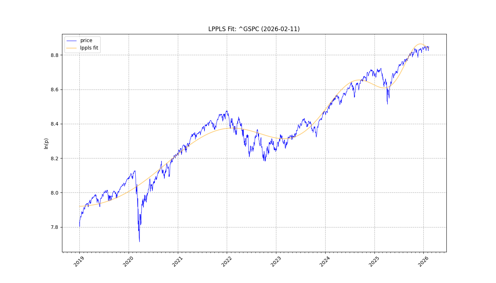
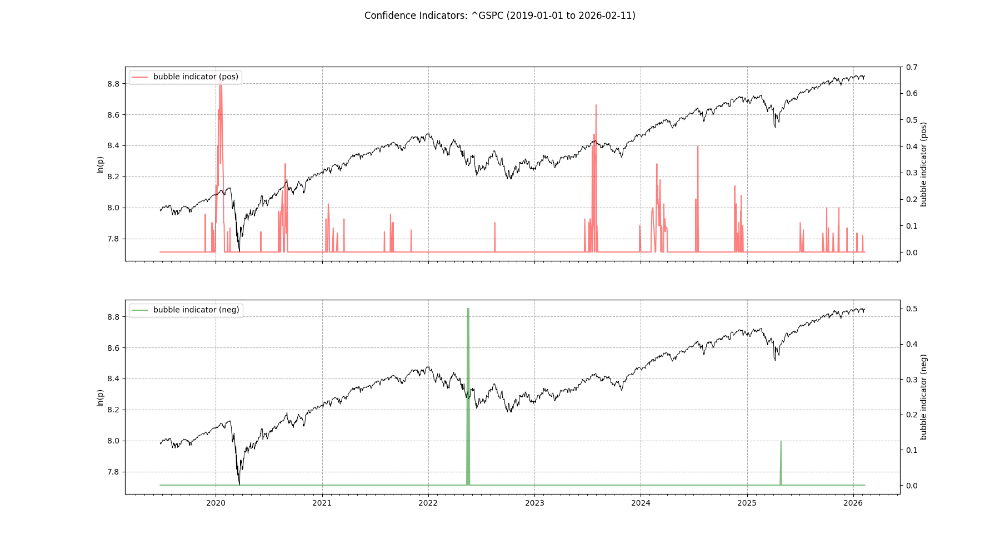
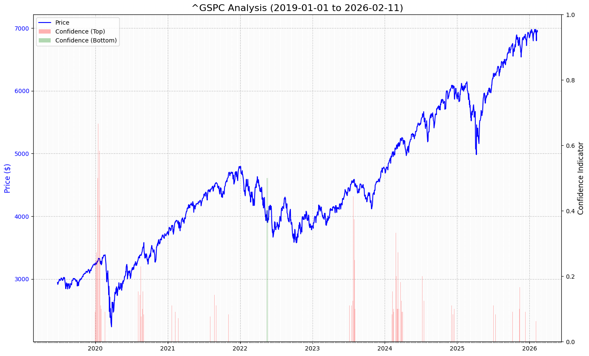
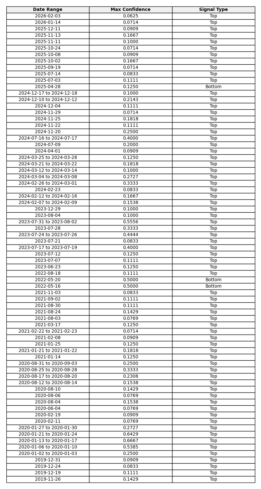

# LPPLS Analyst Report: ^GSPC
**Date:** 2026-02-11

---

## 1. Model Fit & Critical Time ($t_c$)

### What is this?
The **LPPLS (Log-Periodic Power Law Singularity)** model fits a super-exponential growth function to the price history to identify unsustainable trajectories. The **Critical Time ($t_c$)** represents the mathematical limit where the bubble component becomes finite—often coinciding with a change in regime (crash or major correction).

### Analysis
**Projected Critical Time:** 2027-02-02

**Observation:** We are currently **355 days** away from the projected critical point. Historical patterns suggest that price oscillations typically accelerate as we close this gap.

**Visual Interpretation:**
- **Fit Line (Orange)**: Represents the theoretical super-exponential path.
- **Price (Blue)**: Actual market data.
- **Divergence**: If the Price is currently far below the Fit Line, the bubble may have already popped or valid parameters were not found. If Price is hugging the Orange line tightly parabolic, the trend is robust.

---

## 2. Confidence Indicators (Multi-Scale)

### What is this?
Calculating $t_c$ on a single window can be noisy. This section performs **nested fits** across varying time windows (e.g., looking back 30 days vs 120 days).
- **Red Spikes**: Fraction of fits predicting a Top.
- **Green Spikes**: Fraction of fits predicting a Bottom.

### Analysis
High values (close to 1.0) indicate a **consensus** across different timeframes that a specific date was a critical point. Frequent clustering of these spikes suggests a high probability of a turning point.

**Observation:** We see 12 signal clusters with confidence > 30%. This 'agreement' across time scales reinforces the validity of the trend identification.

---

## 3. Cumulative Price & Signal Analysis

### What is this?
This chart overlays the Confidence Signals directly onto the Price History. It is the primary tool for timing.
- **Red Bars**: "Top" confidence. Look for these aligning with new price highs.
- **Green Bars**: "Bottom" confidence. Look for these aligning with price lows (capitulation).

### Analysis
Observe the clusters. A solitary spike might be noise, but a **dense cluster** of bars often precedes a trend reversal.

**Observation:** The last 3 detected signal clusters were all 'Top' signals. The market is persistently testing upper limits.

---

## 4. Signal Data Table

### What is this?
A detailed log of the signal clusters shown above, sorted by **Recency**.
- **Date Range**: The duration where the signal persisted.
- **Max Confidence**: The peak intensity (0.0 to 1.0).

---

## 5. Analyst Conclusion
### Executive Summary
The analysis for **^GSPC** (2019-01-01 to 2026-02-11) has detected a total of **73** significant LPPLS signals.

**Signal Breakdown:**
- **70** Top Signals (Red): Indication of bubble-like behavior and potential local maxima.
- **3** Bottom Signals (Green): Indication of negative bubbles and potential buying opportunities.

**Recent Activity:**
The most recent alert was a **Top** signal observed during **2026-02-03**, peaking at a confidence level of **0.0625**. Traders should watch for price reaction around these levels.
