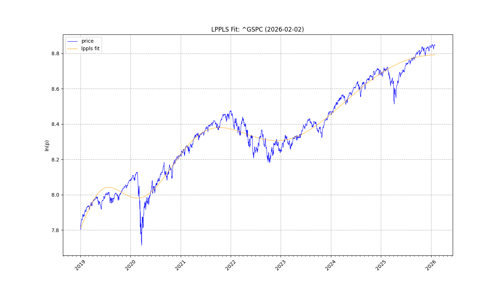
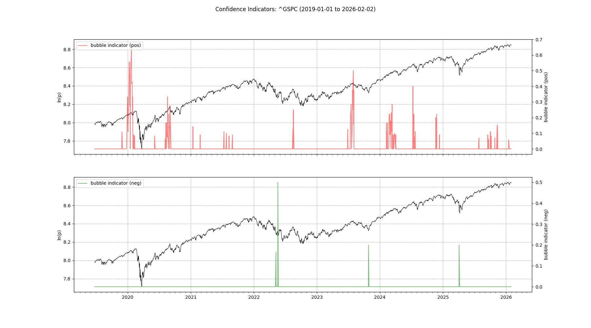
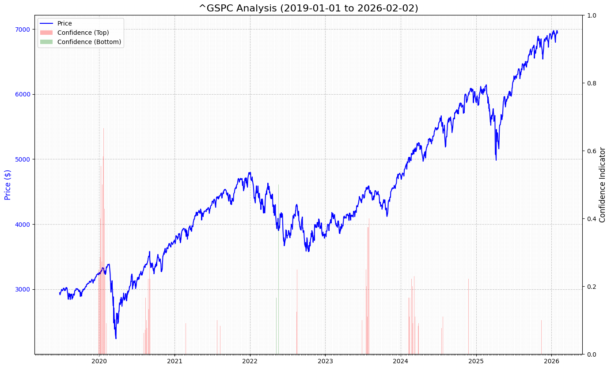
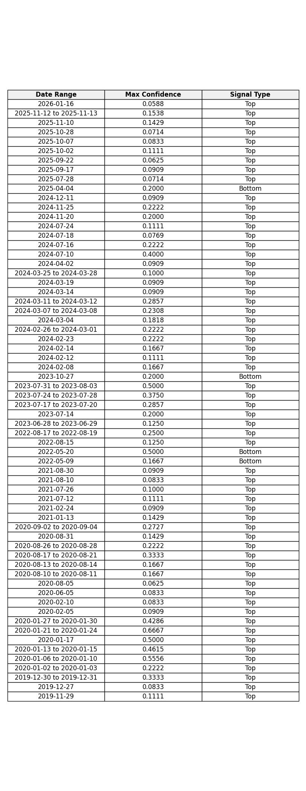

# Report: ^GSPC
**Date:** 2026-02-02

## 1. Fit & Critical Time
**$t_c$ Projection:** 2017-04-16

## 2. Confidence

## 3. Cumulative Chart

## 4. Signal Table

## Summary
Analysis for **^GSPC** (2019-01-01 to 2026-02-02)
Signals Detected: **64**
- **60** Top Signals
- **4** Bottom Signals

Latest: **Top** on **2026-01-16** (Conf: 0.0588).

Projected Critical Time ($t_c$): **2017-04-16**
