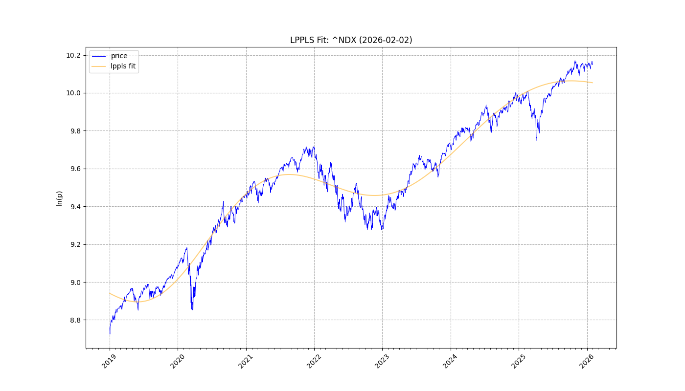
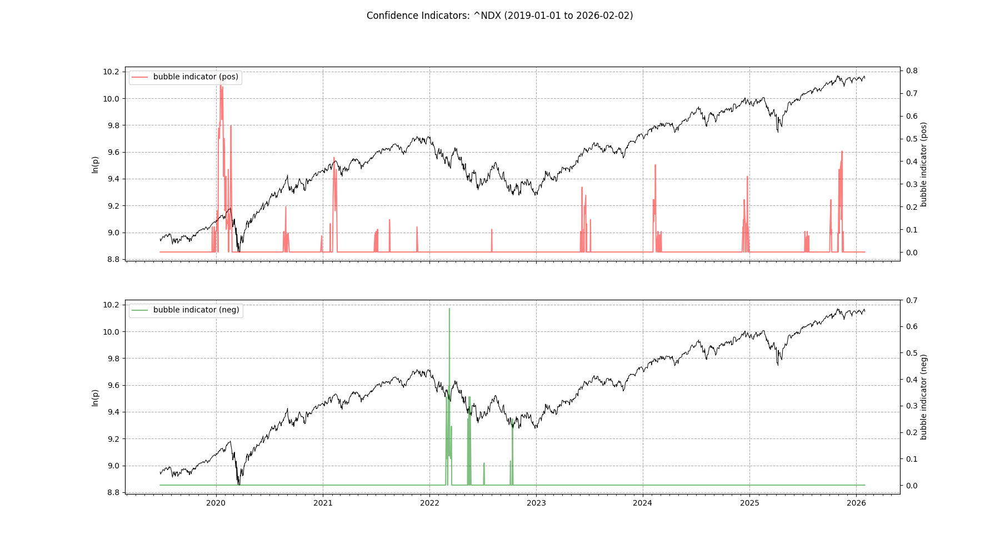
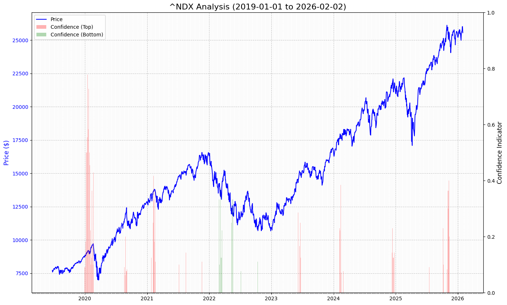
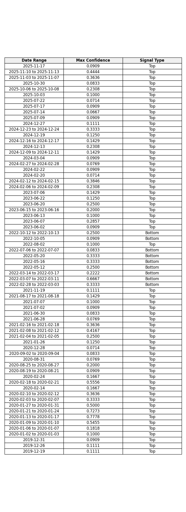

# Report: ^NDX
**Date:** 2026-02-02

## 1. Fit & Critical Time
**$t_c$ Projection:** 2007-10-06

## 2. Confidence

## 3. Cumulative Chart

## 4. Signal Table

## Summary
Analysis for **^NDX** (2019-01-01 to 2026-02-02)
Signals Detected: **68**
- **59** Top Signals
- **9** Bottom Signals

Latest: **Top** on **2025-11-17** (Conf: 0.0909).

Projected Critical Time ($t_c$): **2007-10-06**
