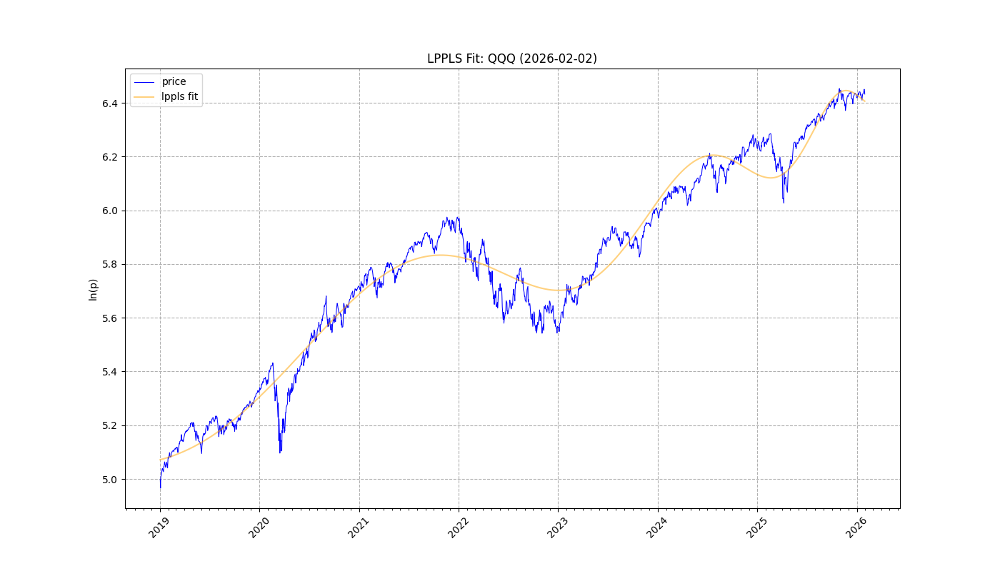
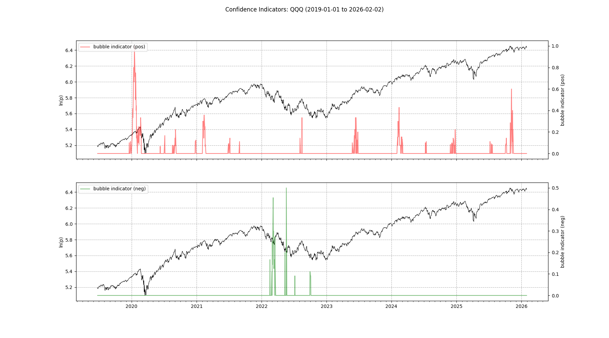
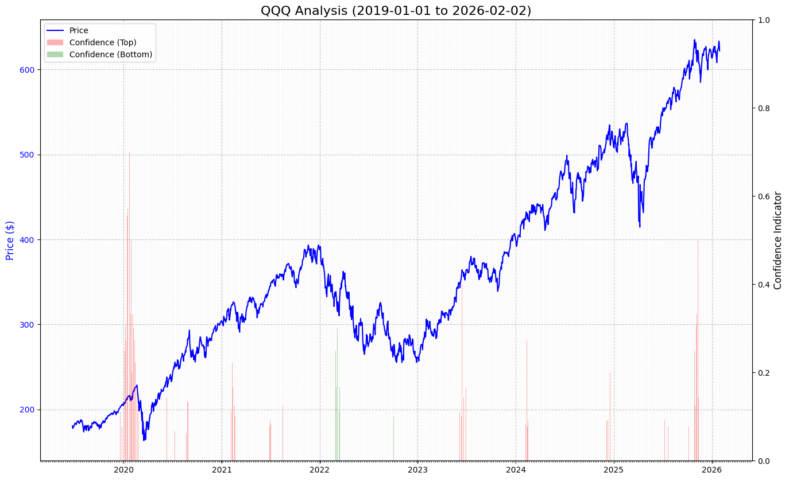
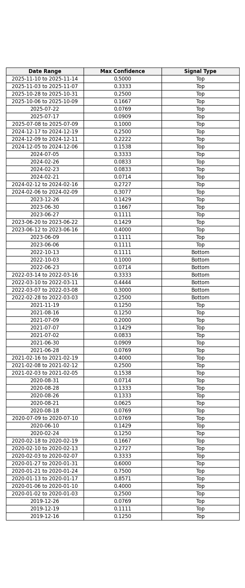

# Report: QQQ
**Date:** 2026-02-02

## 1. Fit & Critical Time
**$t_c$ Projection:** 2027-02-26

## 2. Confidence

## 3. Cumulative Chart

## 4. Signal Table

## Summary
Analysis for **QQQ** (2019-01-01 to 2026-02-02)
Signals Detected: **59**
- **52** Top Signals
- **7** Bottom Signals

Latest: **Top** on **2025-11-10 to 2025-11-14** (Conf: 0.5000).

Projected Critical Time ($t_c$): **2027-02-26**
