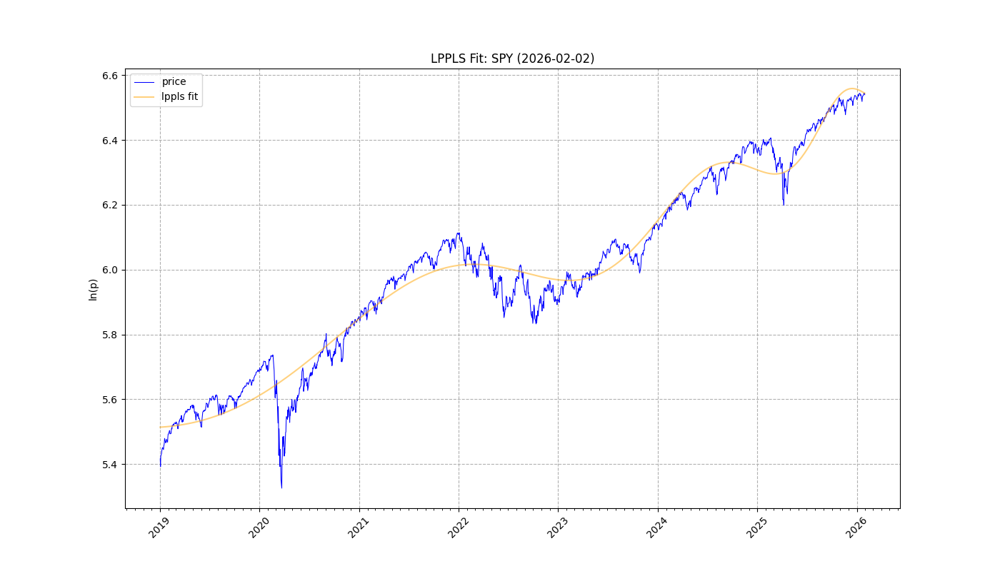
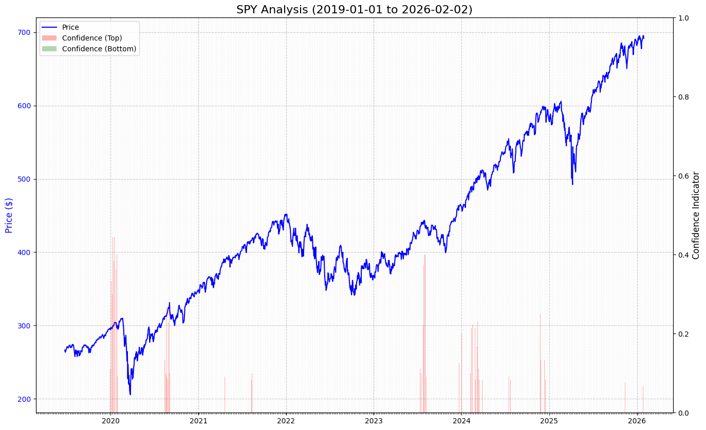
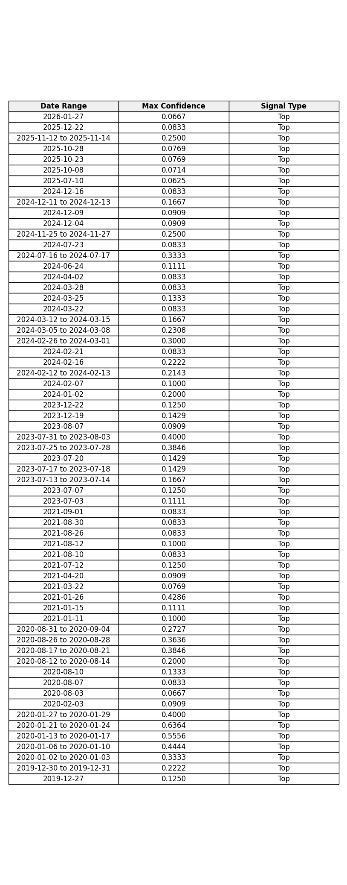

# Report: SPY
**Date:** 2026-02-02

## 1. Fit & Critical Time
**$t_c$ Projection:** 2027-02-16

## 2. Confidence

## 3. Cumulative Chart

## 4. Signal Table

## Summary
Analysis for **SPY** (2019-01-01 to 2026-02-02)
Signals Detected: **63**
- **63** Top Signals
- **0** Bottom Signals

Latest: **Top** on **2026-01-27** (Conf: 0.0667).

Projected Critical Time ($t_c$): **2027-02-16**
